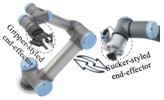
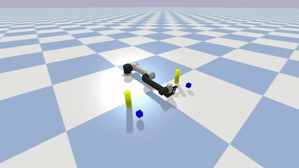

.. _examples_dyn_reconf:

===============================
Dynamic reconfiguration
===============================

In this page,we show how dynamic reconfiguration works by changing the end-effectors.

1. Prerequisites
----------------------------
We assume a working installation of **ManiWare** and Pybullet is available
(see the :ref:`installation page <installation>`),
Moreover, we assume the reader to be familiar with the basic concepts
of Pybullet, Python and **ManiWare**
(see the :ref:`quick start page <quickstart>`).

2. Scenario illustration
----------------------------

3. Problem statement
----------------------------
Give a manipulator that equipped with joints, links, and end-effectors. We suppose to demonstrate the ability
and evaluate the performance of dynamic reconfiguration, we design a scenario when the end-effector of a
manipulator needs to be changed during the system running.

4. Implementation
-----------------------------
When the manipulator requires a change, the component of the gripper-styled end-effector receives a interrupt
command. The reconfiguration mechanism is triggered to keep the context of controllers, and the new
controllers is loaded.

.. highlight:: sh

::

    def main():
        env = ReconfApp(robot_config=[{'Suction': 0}, {'Gripper': 1}], thing_config=[{'cube': 2}, {'cylinder': 2}])
        episode = 3
        for k in range(episode):
            obs = env.reset(cube_num=2, cylinder_num=2)

            # robot, T1, T2 = init(env.robots, env.available_thing_ids_set)
            scheduler = DynamicConfigureScheduler(env.robots, env.available_thing_ids_set)
            scheduler.robot.change_ee('Suction')
            start = time.time()
            step, done, R = 0, False, 0
            while not done:
                # time.sleep(100)
                # action = get_action(env.robots, obs[0], env.available_thing_ids_set, obs[1])
                if len(env.available_thing_ids_set) == 2 and scheduler.robot.action == 'idle' and scheduler.robot.rtype=='Suction':
                    scheduler.robot.ready = False
                    scheduler.robot.change_ee('Gripper')
                # T1, T2 = taskAs(robot, T1, T2)
                scheduler.allocate()
                obs, reward, done, info = env.step()
                R += reward
                sync(step, start, env.TIMESTEP)
                step += 1
        env.close()

   if __name__ == "__main__":
      main()

5. Video demo
------------------------------
The video demo of this case study is shown as below.

Besides, you can find the whole video from `Here <https://youtu.be/JYNg-1WQ7mg/>`_

