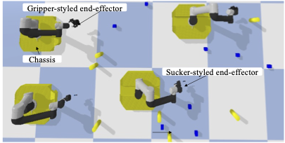
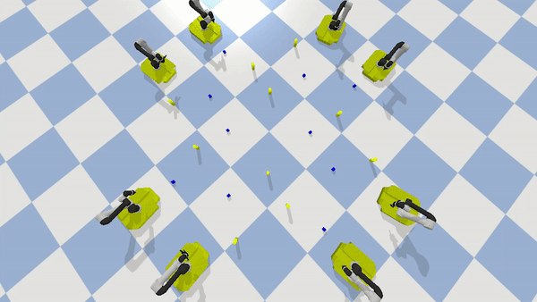

.. _examples_obj_collection:

===============================
Cooperative object collection
===============================

In this page,we show a cooperative object collection case that requires multiple mobile manipulators to
pick the objects from the ground and place the objects into baskets.
The speed of the conveyor belt can be set with different application requirements. 

1. Prerequisites
----------------------------
We assume a working installation of **ManiWare** and Pybullet is available
(see the :ref:`installation page <installation>`),
Moreover, we assume the reader to be familiar with the basic concepts
of Pybullet, Python and **ManiWare**
(see the :ref:`quick start page <quickstart>`).

2. Scenario illustration
----------------------------

3. Problem statement
----------------------------
Given two types of objects :math:`t_1` and :math:`t_2`,  where they are populated in a 2D workspace in different locations.
We assume that the gripper-styled manipulator only can grasp one :math:`t_1` object, and the sucker-styled mobile
manipulator only can hold one :math:`t_2` object at a time. The objective is to assign the object collection tasks
for two types of mobile manipulators, moving and collecting them to achieve a minimum completion time.

4. Implementation
------------------------------
We first define the tasks by implement the interface of :math:`\texttt{BaseTask}`, and define the executors (robots)
by implement the interface of :math:`\texttt{Executor}`. Then, the object of tasks and robots are feed into the
:math:`\texttt{Scheduler}` which allocate the tasks to right robots. In the :math:`\texttt{Scheduler}`, the corresponding
:math:`\texttt{Optimizer}` is used to find the solution with the cost function. Finally, the application can be launched by
allowing the robots to execute allocated tasks with the finite state machine until all the tasks are finished.

.. highlight:: sh

::

    def main():
        env = CollectApp(robot_config=[{'Suction': 4}, {'Gripper': 4}], thing_config=[{'cube': 10}, {'cylinder': 10}])
        episode = 3
        for k in range(episode):
            obs = env.reset(cube_num=10, cylinder_num=10)
            # R1, R2, T1, T2 = init(env.robots, env.available_thing_ids_set)
            scheduler = TraPlanScheduler(env.robots, env.available_thing_ids_set)
            start = time.time()
            step, done, R = 0, False, 0
            while not done:
                # time.sleep(100)
                # T1, T2 = taskAs(T1, T2, R1, R2)
                scheduler.allocate()
                obs, reward, done, info = env.step()
                R += reward
                sync(step, start, env.TIMESTEP)
                step += 1
        env.close()
   if __name__ == "__main__":
      main()

5. Video demo
------------------------------
The video demo of this case study is shown as below.

Besides, you can find the whole video from `Here <https://youtu.be/JYNg-1WQ7mg/>`_

