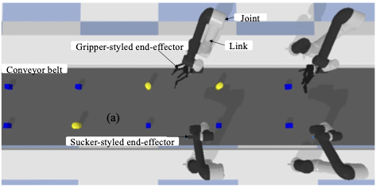
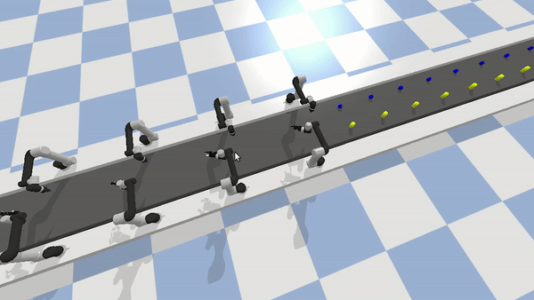

.. _examples_pick_place:

===============================
Cooperative pick-and-place 
===============================

In this page,we show a cooperative pick-and-place case that requires multiple fixed-base manipulators to
pick the packages from the moving conveyor belt and place the packages into baskets. 
The speed of the conveyor belt can be set with different application requirements. 

1. Prerequisites
----------------------------
We assume a working installation of **ManiWare** and Pybullet is available
(see the :ref:`installation page <installation>`),
Moreover, we assume the reader to be familiar with the basic concepts
of Pybullet, Python and **ManiWare**
(see the :ref:`quick start page <quickstart>`).

2. Scenario illustration
----------------------------

3. Problem statement
----------------------------
Given two types of packages :math:`t_1` and :math:`t_2`, where the total number of packages is :math:`n = n_1 + n_2`. 
We assume that the manipulator with a gripper-styled end-effector only can grasp one :math:`t_1` and the
manipulator with a sucker-styled end-effector only can grasp one :math:`t_2` package at a time.
The objective is to assign the package picking tasks for two types of manipulators to achieve a 
high success rate of package picking on a moving conveyor belt.

4. Implementation
------------------------------
We first define the tasks by implement the interface of :math:`\texttt{BaseTask}`, and define the executors (robots)
by implement the interface of :math:`\texttt{Executor}`. Then, the object of tasks and robots are feed into the
:math:`\texttt{Scheduler}` which allocate the tasks to right robots. In the :math:`\texttt{Scheduler}`, the corresponding
:math:`\texttt{Optimizer}` is used to find the solution with the cost function. Finally, the application can be launched by
allowing the robots to execute allocated tasks with the finite state machine until all the tasks are finished.

.. highlight:: sh

::

    def main():
        env = PickAndPlaceApp(robot_config=[{'Suction': 1}, {'Gripper': 1}], thing_config=[{'cube':10}, {'cylinder':10}])
        episode = 10
        for k in range(episode):
            # margin: the distance between thing and next thing
            obs = env.reset(speed = -0.2, cube_num = 10, cylinder_num = 10, margin=1.)
            scheduler = PickPlaceScheduler(env.robots, env.available_thing_ids_set)
            start = time.time()
            step, done, R = 0, False, 0
            while not done:
                # action = get_action(env.robots, obs[0], env.available_thing_ids_set, obs[1])
                # obs, reward, done, info = env.step(action)
                scheduler.allocate()
                obs, reward, done, info = env.step()
                R += reward
                sync(step, start, env.TIMESTEP)
                step += 1
        env.close()
   if __name__ == "__main__":
      main()

5. Video demo
------------------------------
The video demo of this case study is shown as below.

Besides, you can find the whole video from `Here <https://youtu.be/JYNg-1WQ7mg/>`_

