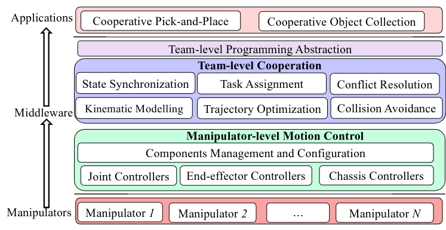

.. _quickstart:

====================
Quick Start
====================

In this page, we first introduce the architecture, then we show how to run the basic applications developed with **ManiWare**.

Prerequisites
---------------------------------------

We assume a working installation of **ManiWare** and Pybullet is available
(see the :ref:`installation page <installation>`).
Moreover, we assume the reader to be familiar with the basic concepts
of **ManiWare**, Pybullet and Python.

ManiWare introduction
---------------------------------------
**ManiWare** is a middleware developed by Zhiqin Cheng and Jinlin Chen from Department of Computing,
The Hong Kong Polytechnic University.

The aim of **ManiWare** is to provide an easy-to-use middleware that provides a team-level programming abstraction and
the manipulator-level plugin mechanism for programming and building manipulator applications.

The package is already equipped with basic team-level cooperation modules, and manipulator-level functional components,
so that developers can start to build the prototype on basic robot models such as mobile manipulator and fixed-base manipulator
for different applications.

We decompose the software stack into two layers to reduce the design complexity, i.e., the team-level cooperation layer
and the manipulator-level motion control layer. The architecture of **ManiWare** is shown as below:

Please refer to :ref:`api_documentation` for a detailed description of the package functionalities.!

How to launch an application
---------------------------------------

We provide three case studies to show the basic features of **ManiWare**. Users can launch the applications directly.

Case study 1: Cooperative pick-and-place

.. code-block:: bash

    cd example
    python3 exp_pick_place.py

Case study 2: Cooperative object collection

.. code-block:: bash

    cd example
    python3 exp_collection.py

Case study 3: Dynamic Reconfiguration

.. code-block:: bash

    cd example
    python3 exp_dyn_reconf.py

Developers can take the above case studies as references to build different applications.

